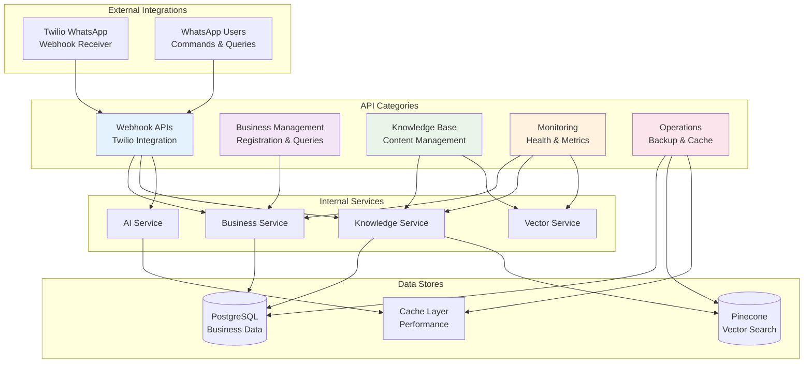
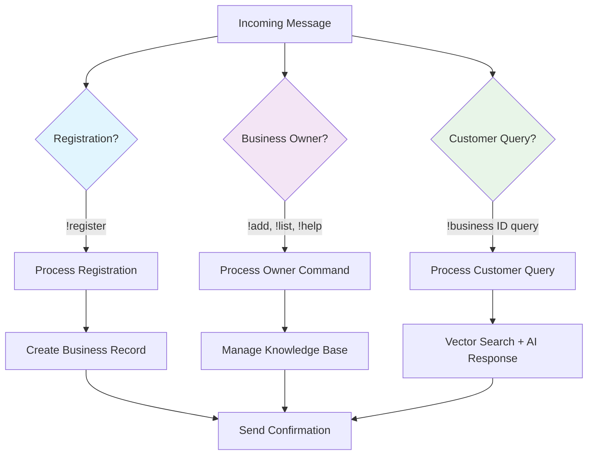
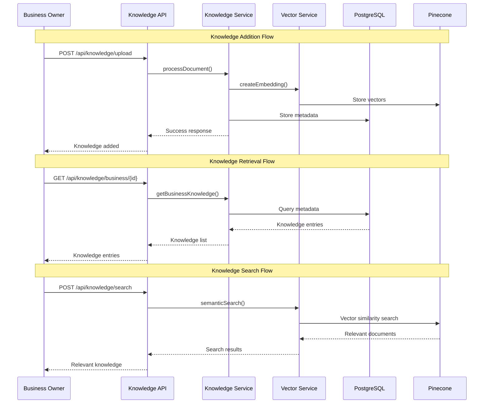
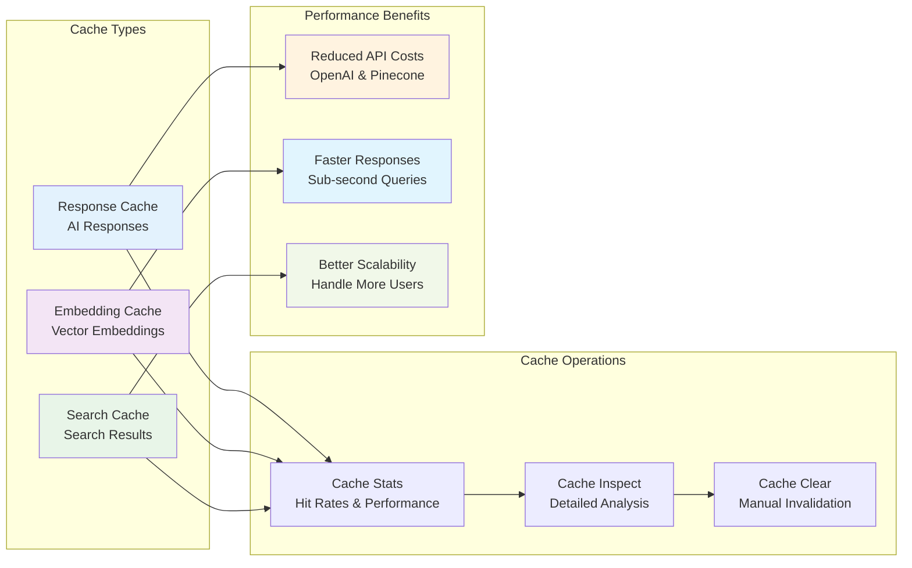
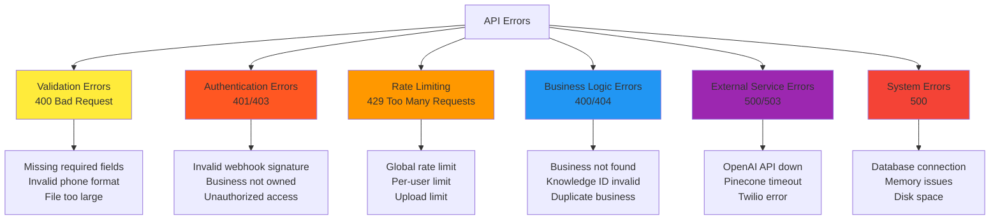

# API Documentation

**Author:** Ravi Kalla <ravi2523096+sbc@gmail.com>  
**Project:** Small Business Chatbot (SBC) System  
**Last Updated:** 2025-06-22

## Table of Contents
- [API Overview](#api-overview)
- [Authentication](#authentication)
- [Webhook Endpoints](#webhook-endpoints)
- [Business Management APIs](#business-management-apis)
- [Knowledge Base APIs](#knowledge-base-apis)
- [Monitoring APIs](#monitoring-apis)
- [Error Handling](#error-handling)

---

## API Overview

The SBC system provides RESTful APIs for business management, knowledge base operations, and system monitoring. All APIs support JSON request/response format with comprehensive error handling.



## Authentication

### Phone-Based Authentication
The system uses phone number-based authentication for business owners:

- **Business Owner Identification**: WhatsApp phone number (`From` field in webhook)
- **Business Verification**: Phone number must be registered business owner
- **Multi-tenant Isolation**: Business data scoped by business ID

### Webhook Security
Twilio webhook signature verification (production):

```javascript
// Webhook signature validation
const crypto = require('crypto');

function validateSignature(signature, url, body, authToken) {
    const expectedSignature = crypto
        .createHmac('sha1', authToken)
        .update(url + body)
        .digest('base64');
    
    return signature === `sha1=${expectedSignature}`;
}
```

---

## Webhook Endpoints

### POST /api/webhook/whatsapp

Primary endpoint for receiving WhatsApp messages from Twilio.

**Request Format (from Twilio):**
```json
{
    "MessageSid": "SM...",
    "AccountSid": "AC...",
    "From": "whatsapp:+15852819787",
    "To": "whatsapp:+14155238886",
    "Body": "!add We serve authentic Indian cuisine",
    "NumMedia": "0",
    "MessageType": "text",
    "ProfileName": "Ravi K"
}
```

**Response:**
```json
{
    "status": "OK"
}
```

**Message Types Handled:**



### Business Owner Commands

| Command | Format | Description |
|---------|--------|-------------|
| `!register` | `!register [Business Name]` | Register new business |
| `!add` | `!add [knowledge text]` | Add text knowledge |
| `!list` | `!list` | List knowledge entries |
| `!delete` | `!delete [knowledge-id]` | Delete knowledge entry |
| `!help` | `!help` | Show available commands |

### Customer Commands

| Command | Format | Description |
|---------|--------|-------------|
| `!business` | `!business [ID] [question]` | Query business knowledge |

---

## Business Management APIs

### POST /api/businesses

Register a new business programmatically.

**Request:**
```json
{
    "businessName": "Ravi Indian Restaurant",
    "whatsappNumber": "whatsapp:+14155238886",
    "ownerPhone": "+15852819787"
}
```

**Response:**
```json
{
    "success": true,
    "message": "Business registered successfully",
    "businessId": "raviindi_6615",
    "whatsappNumber": "whatsapp:+14155238886"
}
```

**Error Response:**
```json
{
    "success": false,
    "message": "Business name already exists"
}
```

### GET /api/businesses

List all registered businesses.

**Response:**
```json
{
    "success": true,
    "businesses": [
        {
            "businessId": "raviindi_6615",
            "businessName": "Ravi Indian Restaurant",
            "whatsappNumber": "whatsapp:+14155238886", 
            "ownerPhone": "+15852819787",
            "registeredAt": "2025-06-22T20:33:16.713Z",
            "status": "active"
        }
    ]
}
```

### GET /api/twilio/status

Get Twilio service statistics.

**Response:**
```json
{
    "success": true,
    "businesses": 1,
    "totalMessages": 150,
    "messagesSentToday": 12,
    "lastActivity": "2025-06-22T20:33:16.713Z",
    "isHealthy": true
}
```

---

## Knowledge Base APIs

### Knowledge Base Flow



### POST /api/knowledge/upload

Upload and process documents for a business.

**Request (multipart/form-data):**
```
businessId: raviindi_6615
file: [PDF/TXT file]
```

**Response:**
```json
{
    "success": true,
    "message": "Document processed successfully",
    "knowledgeId": "kb_raviindi_6615_1640995200_abc123",
    "chunks": 5,
    "vectors": 5
}
```

### GET /api/knowledge/business/:businessId/documents

List documents for a specific business.

**Response:**
```json
{
    "success": true,
    "documents": [
        {
            "knowledgeId": "kb_raviindi_6615_1640995200_abc123",
            "filename": "menu.pdf",
            "type": "document",
            "contentPreview": "We serve authentic Indian cuisine...",
            "createdAt": "2025-06-22T20:33:16.713Z"
        }
    ],
    "total": 1
}
```

### POST /api/knowledge/search

Perform semantic search across business knowledge.

**Request:**
```json
{
    "businessId": "raviindi_6615",
    "query": "What vegetarian options do you have?",
    "topK": 3
}
```

**Response:**
```json
{
    "success": true,
    "results": [
        {
            "knowledgeId": "kb_raviindi_6615_1640995200_abc123",
            "content": "We offer vegetarian dishes including...",
            "score": 0.89,
            "metadata": {
                "filename": "menu.pdf",
                "chunk": 2
            }
        }
    ]
}
```

---

## Monitoring APIs

### GET /health

Comprehensive system health check.

**Response:**
```json
{
    "status": "ok",
    "timestamp": "2025-06-22T21:15:58.442Z",
    "database": {
        "status": "connected",
        "isHealthy": true,
        "url": "https://lelsrnqukkhrfplfkqop.supabase.co",
        "latency": "253ms",
        "lastError": null
    },
    "vectorDB": {
        "isHealthy": true,
        "indexName": "sbc-businessdata",
        "latency": "180ms"
    },
    "twilio": {
        "isHealthy": true,
        "accountSid": "ACxxxxxxxxxxxxxxxxxxxxxxxxxxxxxx"
    },
    "uptime": 944.36600749
}
```

### GET /api/metrics

Application performance metrics.

**Response:**
```json
{
    "success": true,
    "metrics": {
        "name": "sbc-system",
        "status": "online",
        "uptime": 3600000,
        "restarts": 0,
        "memory": "125 MB",
        "cpu": "2.5%",
        "pid": 12345,
        "version": "1.1.1"
    },
    "timestamp": "2025-06-22T21:15:58.442Z"
}
```

### GET /api/logs

Application logs with filtering.

**Query Parameters:**
- `lines`: Number of lines (default: 100)
- `filter`: Filter text
- `level`: Log level (all, error, warn, info, debug)

**Response:**
```json
{
    "success": true,
    "logs": [
        "2025-06-22T21:15:58.442Z [INFO] [WEBHOOK] Processing message from +15852819787",
        "2025-06-22T21:15:58.500Z [INFO] [AI] Generated response for business raviindi_6615"
    ],
    "total": 2,
    "filter": "WEBHOOK",
    "level": "info",
    "timestamp": "2025-06-22T21:15:58.442Z"
}
```

---

## Cache Management APIs

### Cache Architecture



### GET /api/cache/stats

Cache performance statistics.

**Response:**
```json
{
    "success": true,
    "stats": {
        "hitRate": "78.5%",
        "hits": 1250,
        "misses": 340,
        "saves": 1590,
        "cacheSize": {
            "responses": 45,
            "embeddings": 128,
            "searches": 67
        }
    }
}
```

### POST /api/cache/clear

Clear application caches.

**Request:**
```json
{
    "type": "responses",  // Optional: specific cache type
    "businessId": "raviindi_6615"  // Optional: business-specific
}
```

**Response:**
```json
{
    "success": true,
    "message": "Cleared 15 cache entries for business raviindi_6615"
}
```

---

## Backup & Operations APIs

### POST /api/backup/create

Create system backup.

**Request:**
```json
{
    "type": "full"  // full|incremental|business-specific
}
```

**Response:**
```json
{
    "success": true,
    "backupId": "backup_20250622_211558",
    "location": "/backups/backup_20250622_211558.tar.gz",
    "size": "15.2 MB",
    "businesses": 5,
    "knowledgeEntries": 127
}
```

### GET /api/backup/list

List available backups.

**Response:**
```json
{
    "success": true,
    "backups": [
        {
            "backupId": "backup_20250622_211558",
            "createdAt": "2025-06-22T21:15:58.442Z",
            "size": "15.2 MB",
            "type": "full"
        }
    ]
}
```

---

## Error Handling

### Standard Error Response Format

```json
{
    "success": false,
    "error": "Business not found",
    "code": "BUSINESS_NOT_FOUND",
    "details": {
        "businessId": "invalid_123",
        "requestId": "req_abc123"
    },
    "timestamp": "2025-06-22T21:15:58.442Z"
}
```

### HTTP Status Codes

| Code | Description | Usage |
|------|-------------|-------|
| 200 | OK | Successful operation |
| 201 | Created | Resource created successfully |
| 400 | Bad Request | Invalid request data |
| 401 | Unauthorized | Authentication required |
| 403 | Forbidden | Access denied |
| 404 | Not Found | Resource not found |
| 429 | Too Many Requests | Rate limit exceeded |
| 500 | Internal Server Error | Server error |

### Error Categories



### Rate Limiting

```json
{
    "success": false,
    "error": "Rate limit exceeded",
    "code": "RATE_LIMIT_EXCEEDED",
    "details": {
        "limit": "10 requests per hour",
        "remaining": 0,
        "resetTime": "2025-06-22T22:15:58.442Z"
    }
}
```

This comprehensive API documentation provides all the information needed to integrate with and extend the SBC system effectively.