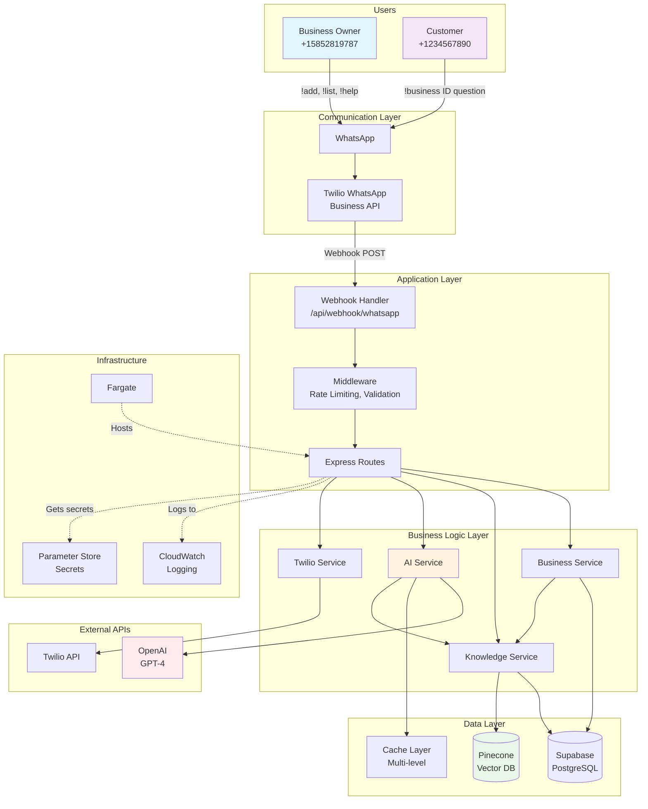
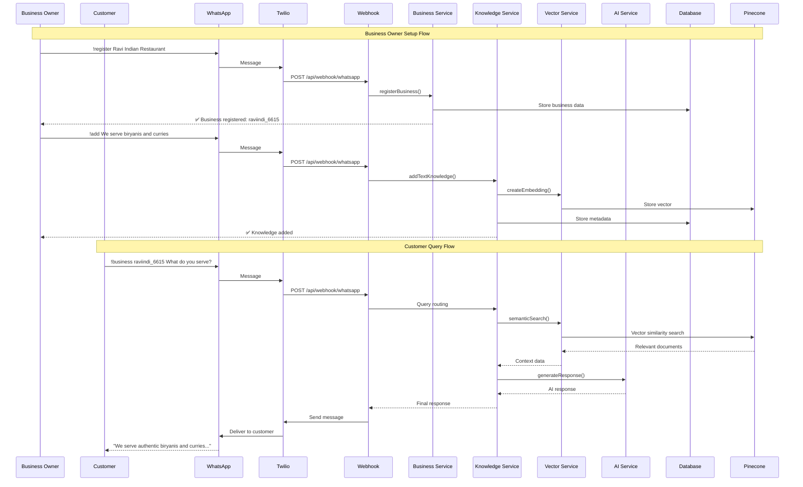
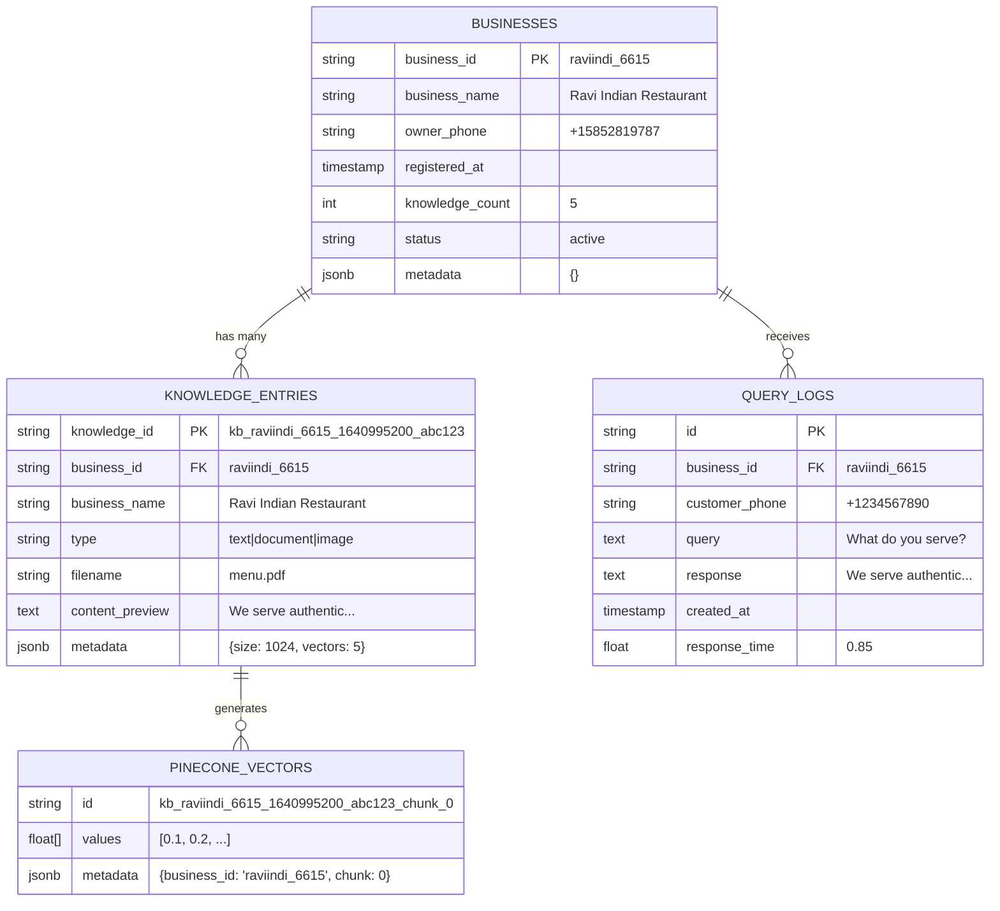
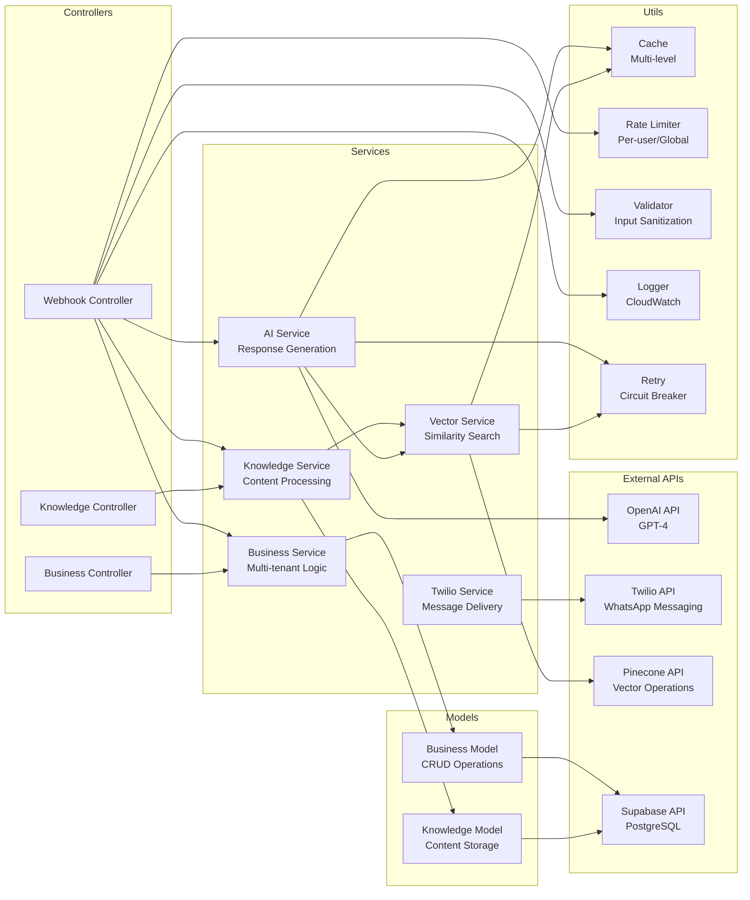
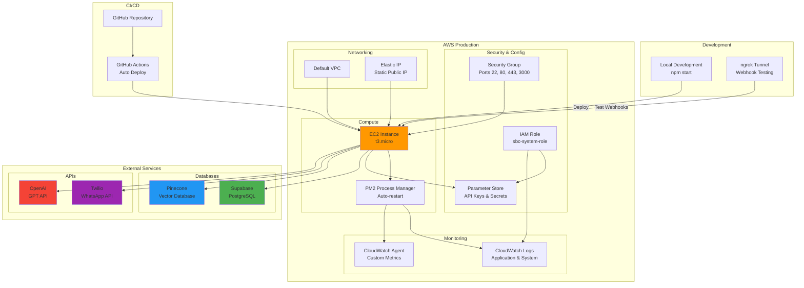
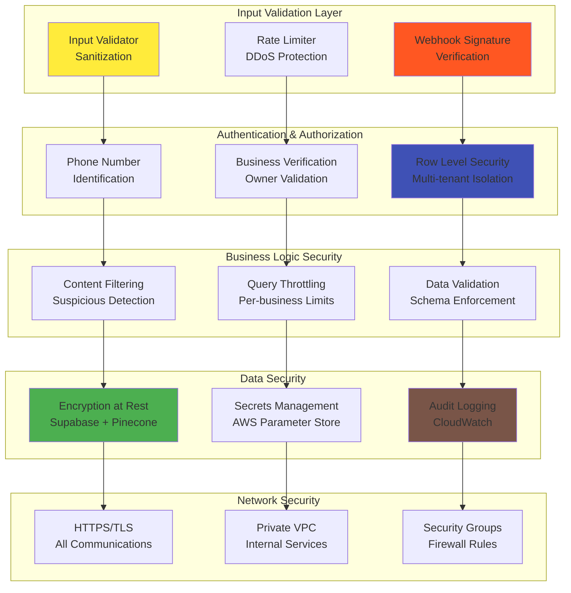
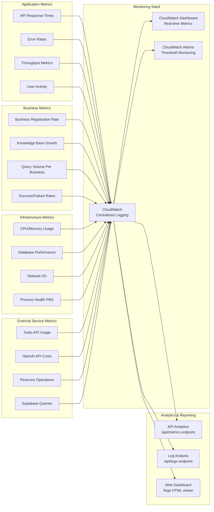

# System Architecture Overview

**Author:** Ravi Kalla <ravi2523096+sbc@gmail.com>  
**Project:** Small Business Chatbot (SBC) System  
**Last Updated:** 2025-06-22

## Table of Contents
- [High-Level System Architecture](#high-level-system-architecture)
- [Message Flow Architecture](#message-flow-architecture)
- [Multi-Tenant Data Architecture](#multi-tenant-data-architecture)
- [Service Layer Architecture](#service-layer-architecture)
- [Infrastructure & Deployment](#infrastructure--deployment)
- [Security & Data Flow](#security--data-flow)
- [Monitoring & Analytics](#monitoring--analytics)

---

## High-Level System Architecture

The SBC system is a multi-tenant WhatsApp AI assistant platform that enables small businesses to provide 24/7 customer support through intelligent chatbots.

### Key Components:

- **Users**: Business owners manage knowledge base, customers query businesses
- **Communication Layer**: WhatsApp integration via Twilio Business API
- **Application Layer**: Express.js server with webhook handling and middleware
- **Business Logic**: Modular services for business management, knowledge processing, and AI
- **Data Layer**: PostgreSQL for structured data, Pinecone for vector search, caching for performance
- **External APIs**: OpenAI for AI responses, Twilio for messaging
- **Infrastructure**: AWS hosting with monitoring and secrets management

---

## Message Flow Architecture

This sequence diagram shows how messages flow through the system from business setup to customer queries.

### Flow Explanation:

1. **Business Registration**: Owner registers business via WhatsApp, system creates business record
2. **Knowledge Addition**: Owner adds content, system creates embeddings and stores in vector database
3. **Customer Query**: Customer asks question, system searches knowledge base and generates AI response
4. **Response Delivery**: AI response delivered back through WhatsApp to customer

---

## Multi-Tenant Data Architecture

The system supports multiple businesses with complete data isolation and efficient query performance.

### Data Model Features:

- **Business Isolation**: Each business has unique ID with scoped data access
- **Knowledge Management**: Text and document content with vector representations
- **Analytics Tracking**: Query logs for business intelligence and performance monitoring
- **Flexible Metadata**: JSONB fields for extensible data without schema changes

---

## Service Layer Architecture

The modular service architecture enables maintainable, testable, and scalable code organization.

### Service Responsibilities:

- **Controllers**: Handle HTTP requests, route to appropriate services
- **Services**: Implement business logic, coordinate between models and external APIs
- **Models**: Data access layer with database operations
- **Utils**: Cross-cutting concerns like caching, logging, validation

---

## Infrastructure & Deployment

Production deployment on AWS with automated CI/CD and comprehensive monitoring.

### Deployment Features:

- **Local Development**: Hot reload with ngrok for webhook testing
- **Production**: AWS Fargate with PM2 process management
- **Monitoring**: CloudWatch for logs and metrics
- **Security**: IAM roles, Parameter Store for secrets
- **CI/CD**: GitHub Actions for automated deployment

---

## Security & Data Flow

Multi-layered security approach protecting data, APIs, and user interactions.

### Security Layers:

- **Input Validation**: Sanitization and rate limiting at entry points
- **Authentication**: Phone-based identification with business verification
- **Data Security**: Encryption, secrets management, and audit logging
- **Network Security**: HTTPS, VPC isolation, and firewall rules
- **Business Logic**: Content filtering and query throttling

---

## Monitoring & Analytics

Comprehensive observability across application, business, and infrastructure metrics.

### Monitoring Capabilities:

- **Application Metrics**: Performance, errors, and user activity tracking
- **Business Metrics**: Registration rates, knowledge growth, query patterns
- **Infrastructure Metrics**: System health, database performance, network activity
- **External Service Metrics**: API usage, costs, and performance of third-party services
- **Centralized Monitoring**: CloudWatch integration with dashboards and alerting

---

## Architecture Benefits

### Scalability
- **Multi-tenant**: Supports unlimited businesses with data isolation
- **Microservices**: Modular architecture enables independent scaling
- **Caching**: Multi-level caching reduces database load and API costs
- **Vector Search**: Efficient semantic search scales to millions of documents

### Reliability
- **Circuit Breakers**: Graceful degradation when external services fail
- **Health Monitoring**: Comprehensive health checks and alerting
- **Auto-restart**: PM2 process management with automatic recovery
- **Backup Systems**: Automated data backup and restore capabilities

### Security
- **Multi-layered**: Defense in depth with validation, authentication, and encryption
- **Zero Trust**: All communications encrypted and verified
- **Audit Trail**: Comprehensive logging for compliance and debugging
- **Secrets Management**: Centralized secret storage with AWS Parameter Store

### Maintainability
- **Clean Architecture**: Clear separation of concerns with modular design
- **Documentation**: Comprehensive documentation with visual diagrams
- **Testing**: Modular structure enables unit and integration testing
- **Monitoring**: Observable systems with detailed metrics and logging

This architecture supports a production-ready, enterprise-grade WhatsApp AI platform capable of serving thousands of businesses with high reliability, security, and performance.
