# Deployment Guide

**Author:** Ravi Kalla <ravi2523096+sbc@gmail.com>  
**Project:** Small Business Chatbot (SBC) System  
**Last Updated:** 2025-06-22

## Table of Contents
- [Deployment Overview](#deployment-overview)
- [Local Development Setup](#local-development-setup)
- [Production Deployment](#production-deployment)
- [Infrastructure as Code](#infrastructure-as-code)
- [CI/CD Pipeline](#cicd-pipeline)
- [Monitoring & Maintenance](#monitoring--maintenance)
- [Troubleshooting](#troubleshooting)

---

## Deployment Overview

The SBC system supports multiple deployment scenarios from local development to production AWS infrastructure with automated CI/CD.


## Local Development Setup

### Prerequisites

```bash
# Node.js (v18+)
node --version  # v18.0.0+
npm --version   # 8.0.0+

# Git
git --version

# Optional: Docker for containerized development
docker --version
```

### Environment Setup

1. **Clone Repository:**
```bash
git clone https://github.com/ravikalla/ai-small-business-customercare.git
cd ai-small-business-customercare
```

2. **Install Dependencies:**
```bash
npm install
```

3. **Environment Configuration:**
```bash
# Copy environment template
cp .env.example .env

# Edit with your credentials
nano .env
```

4. **Required Environment Variables:**
```bash
# Database Configuration
SUPABASE_URL=https://your-project.supabase.co
SUPABASE_ANON_KEY=your-anon-key

# AI Services
OPENAI_API_KEY=sk-proj-your-key
PINECONE_API_KEY=pcsk_your-key
PINECONE_INDEX_NAME=sbc-businessdata
PINECONE_ENVIRONMENT=your-environment

# Twilio (Sandbox for development)
TWILIO_ACCOUNT_SID=AC...
TWILIO_AUTH_TOKEN=your-token
TWILIO_WHATSAPP_NUMBER=whatsapp:+14155238886

# Application
NODE_ENV=development
PORT=3000
```

### Development Workflow


### Local Development Commands

```bash
# Start development server
npm start

# Start with hot reload (if configured)
npm run dev

# Run tests
npm test

# Code linting
npm run lint

# Type checking (if TypeScript)
npm run type-check

# Start ngrok tunnel for webhook testing
ngrok http 3000
```

---

## Production Deployment

### AWS Infrastructure Requirements


### Manual Deployment Steps

1. **Create AWS Resources:**
```bash
# Create EC2 instance
aws ec2 run-instances \
    --image-id ami-0c02fb55956c7d316 \
    --instance-type t3.micro \
    --key-name sbc-system-key \
    --security-group-ids sg-xxxxxxxxx \
    --subnet-id subnet-xxxxxxxxx \
    --tag-specifications 'ResourceType=instance,Tags=[{Key=Name,Value=sbc-system}]'
```

2. **Configure Security Group:**
```bash
# Allow SSH (22), HTTP (80), HTTPS (443), App (3000)
aws ec2 authorize-security-group-ingress \
    --group-id sg-xxxxxxxxx \
    --protocol tcp \
    --port 22 \
    --cidr 0.0.0.0/0

aws ec2 authorize-security-group-ingress \
    --group-id sg-xxxxxxxxx \
    --protocol tcp \
    --port 80 \
    --cidr 0.0.0.0/0

aws ec2 authorize-security-group-ingress \
    --group-id sg-xxxxxxxxx \
    --protocol tcp \
    --port 443 \
    --cidr 0.0.0.0/0

aws ec2 authorize-security-group-ingress \
    --group-id sg-xxxxxxxxx \
    --protocol tcp \
    --port 3000 \
    --cidr 0.0.0.0/0
```

3. **Setup IAM Role:**
```bash
# Create IAM role for EC2
aws iam create-role \
    --role-name sbc-system-role \
    --assume-role-policy-document file://trust-policy.json

# Attach policies
aws iam attach-role-policy \
    --role-name sbc-system-role \
    --policy-arn arn:aws:iam::aws:policy/CloudWatchAgentServerPolicy

aws iam attach-role-policy \
    --role-name sbc-system-role \
    --policy-arn arn:aws:iam::aws:policy/AmazonSSMReadOnlyAccess
```

4. **Deploy Application:**
```bash
# SSH to EC2 instance
ssh -i ~/.ssh/sbc-system-key.pem ubuntu@your-ec2-public-ip

# Install Node.js and dependencies
curl -fsSL https://deb.nodesource.com/setup_18.x | sudo -E bash -
sudo apt-get install -y nodejs

# Install PM2 process manager
sudo npm install -g pm2

# Clone and setup application
git clone https://github.com/ravikalla/ai-small-business-customercare.git
cd ai-small-business-customercare
npm install

# Configure environment variables
sudo nano /etc/environment
# Add all required environment variables

# Start application with PM2
pm2 start src/index.js --name sbc-system
pm2 startup
pm2 save
```

---

## Infrastructure as Code

### Terraform Configuration

The project includes complete Terraform configuration for automated infrastructure deployment:

```mermaid
graph TB
    subgraph "Terraform Modules"
        MAIN[main.tf<br/>Main Configuration]
        VARS[variables.tf<br/>Input Variables]
        OUTPUTS[outputs.tf<br/>Outputs]
        TFVARS[terraform.tfvars<br/>Values]
    end
    
    subgraph "AWS Resources Created"
        VPC_MODULE[VPC Module<br/>Network Setup]
        EC2_MODULE[EC2 Module<br/>Compute Instance]
        IAM_MODULE[IAM Module<br/>Permissions]
        MONITOR_MODULE[Monitoring Module<br/>CloudWatch]
    end
    
    subgraph "Resource Dependencies"
        VPC_DEPS[VPC → Subnets → Security Groups]
        EC2_DEPS[EC2 → IAM Role → Parameter Store]
        MONITOR_DEPS[CloudWatch → Log Groups → Alarms]
    end
    
    MAIN --> VPC_MODULE
    MAIN --> EC2_MODULE
    MAIN --> IAM_MODULE
    MAIN --> MONITOR_MODULE
    
    VARS --> TFVARS
    TFVARS --> MAIN
    
    VPC_MODULE --> VPC_DEPS
    EC2_MODULE --> EC2_DEPS
    MONITOR_MODULE --> MONITOR_DEPS
    
    style MAIN fill:#e3f2fd
    style EC2_MODULE fill:#fff3e0
    style IAM_MODULE fill:#e8f5e8
    style MONITOR_MODULE fill:#f3e5f5
```



### Terraform Deployment

1. **Initialize Terraform:**
```bash
cd infrastructure/terraform
terraform init
```

2. **Configure Variables:**
```bash
# Copy example configuration
cp terraform.tfvars.example terraform.tfvars

# Edit with your values
nano terraform.tfvars
```

3. **Plan Deployment:**
```bash
terraform plan
```

4. **Deploy Infrastructure:**
```bash
terraform apply
```

5. **Get Outputs:**
```bash
terraform output
```

### Terraform Configuration Example

```hcl
# infrastructure/terraform/main.tf
provider "aws" {
  region = var.aws_region
}

# VPC and Networking
resource "aws_vpc" "main" {
  cidr_block           = "10.0.0.0/16"
  enable_dns_hostnames = true
  enable_dns_support   = true

  tags = {
    Name = "${var.project_name}-vpc"
  }
}

# EC2 Instance
resource "aws_instance" "app" {
  ami                    = "ami-0c02fb55956c7d316"
  instance_type          = var.instance_type
  key_name               = var.key_pair_name
  vpc_security_group_ids = [aws_security_group.app.id]
  subnet_id              = aws_subnet.public.id
  iam_instance_profile   = aws_iam_instance_profile.app.name

  user_data = file("user-data.sh")

  tags = {
    Name = "${var.project_name}-app"
  }
}

# IAM Role for EC2
resource "aws_iam_role" "app" {
  name = "${var.project_name}-role"

  assume_role_policy = jsonencode({
    Version = "2012-10-17"
    Statement = [
      {
        Action = "sts:AssumeRole"
        Effect = "Allow"
        Principal = {
          Service = "ec2.amazonaws.com"
        }
      }
    ]
  })
}

# CloudWatch Log Group
resource "aws_cloudwatch_log_group" "app" {
  name              = "/aws/ec2/${var.project_name}"
  retention_in_days = 30
}
```

---

## CI/CD Pipeline

### GitHub Actions Workflow


### GitHub Actions Configuration

```yaml
# .github/workflows/deploy.yml
name: Deploy to AWS EC2

on:
  push:
    branches: [main]
  workflow_dispatch:

jobs:
  test:
    runs-on: ubuntu-latest
    steps:
      - uses: actions/checkout@v3
      
      - name: Setup Node.js
        uses: actions/setup-node@v3
        with:
          node-version: '18'
          cache: 'npm'
      
      - name: Install dependencies
        run: npm ci
      
      - name: Run linting
        run: npm run lint
      
      - name: Run tests
        run: npm test

  deploy:
    needs: test
    runs-on: ubuntu-latest
    if: github.ref == 'refs/heads/main'
    
    steps:
      - uses: actions/checkout@v3
      
      - name: Deploy to EC2
        uses: appleboy/ssh-action@v0.1.5
        with:
          host: ${{ secrets.EC2_HOST }}
          username: ubuntu
          key: ${{ secrets.EC2_SSH_KEY }}
          script: |
            cd /home/ubuntu/ai-small-business-customercare
            git pull origin main
            npm install
            pm2 restart sbc-system
            pm2 save
      
      - name: Health Check
        run: |
          sleep 30
          curl -f ${{ secrets.APP_URL }}/health
```

### Environment Secrets

Configure these secrets in GitHub repository settings:

```bash
# AWS Configuration
AWS_ACCESS_KEY_ID=AKIA...
AWS_SECRET_ACCESS_KEY=...
AWS_REGION=us-east-1

# EC2 Configuration
EC2_HOST=your-ec2-public-ip
EC2_SSH_KEY=your-private-key-content
APP_URL=http://your-ec2-public-ip:3000

# Application Secrets
OPENAI_API_KEY=sk-proj-...
PINECONE_API_KEY=pcsk_...
TWILIO_AUTH_TOKEN=...
SUPABASE_ANON_KEY=...
```

---

## Monitoring & Maintenance

### CloudWatch Monitoring Setup


### Health Monitoring

```bash
# Setup health check monitoring
#!/bin/bash
# /usr/local/bin/health-check.sh

HEALTH_URL="http://localhost:3000/health"
WEBHOOK_URL="your-slack-webhook-url"

response=$(curl -s -o /dev/null -w "%{http_code}" $HEALTH_URL)

if [ $response != "200" ]; then
    echo "Health check failed with status: $response"
    
    # Send alert to Slack
    curl -X POST -H 'Content-type: application/json' \
        --data '{"text":"🚨 SBC System health check failed!"}' \
        $WEBHOOK_URL
    
    # Restart application
    pm2 restart sbc-system
fi
```

### Backup Strategy

```bash
# Automated backup script
#!/bin/bash
# /usr/local/bin/backup.sh

DATE=$(date +%Y%m%d_%H%M%S)
BACKUP_DIR="/backups"
S3_BUCKET="sbc-system-backups"

# Create application backup
curl -X POST http://localhost:3000/api/backup/create \
    -H "Content-Type: application/json" \
    -d '{"type": "full"}'

# Upload to S3
aws s3 cp $BACKUP_DIR/ s3://$S3_BUCKET/daily/ --recursive

# Cleanup old backups (keep 30 days)
find $BACKUP_DIR -type f -mtime +30 -delete
```

---

## Troubleshooting

### Common Issues and Solutions


### Debugging Commands

```bash
# Check application status
pm2 status
pm2 logs sbc-system --lines 100

# Check system resources
htop
df -h
free -m

# Check network connectivity
curl -I http://localhost:3000/health
netstat -tlnp | grep 3000

# Check CloudWatch logs
aws logs describe-log-groups
aws logs get-log-events --log-group-name "/aws/ec2/sbc-system"

# Database connectivity
curl -X GET "http://localhost:3000/health" | jq '.database'

# External API status
curl -X GET "http://localhost:3000/api/twilio/status"
```

### Performance Optimization

```bash
# Node.js performance tuning
export NODE_OPTIONS="--max-old-space-size=2048"

# PM2 cluster mode for multi-core
pm2 start src/index.js --name sbc-system --instances max

# Enable compression
npm install compression
# Add to Express app: app.use(compression())

# Database query optimization
# Monitor slow queries in Supabase dashboard
# Add database indexes for frequently queried fields

# Caching optimization
# Monitor cache hit rates
curl -X GET "http://localhost:3000/api/cache/stats"
```

This comprehensive deployment guide covers all aspects of deploying and maintaining the SBC system in production environments with best practices for reliability, security, and performance.